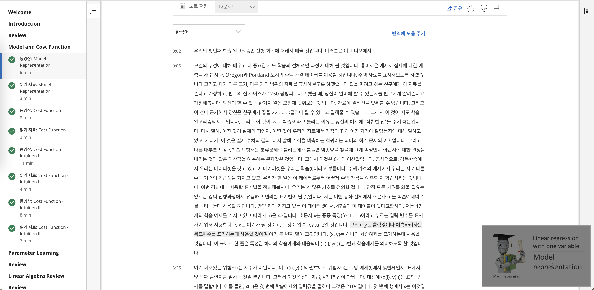

# coursera-study-helper

When learning Coursera, it is a chrome extension that fixes the video at the top and scrolls only the script below.

## Screenshots

### Before

### After

## References

- [https://developer.chrome.com/docs/extensions/mv3/getstarted/](https://developer.chrome.com/docs/extensions/mv3/getstarted/)
